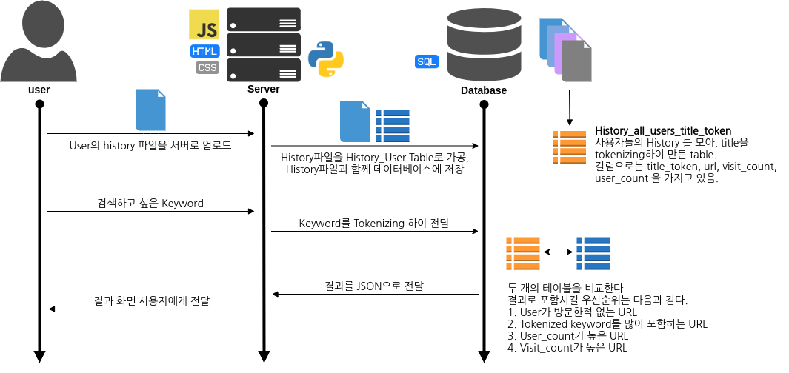
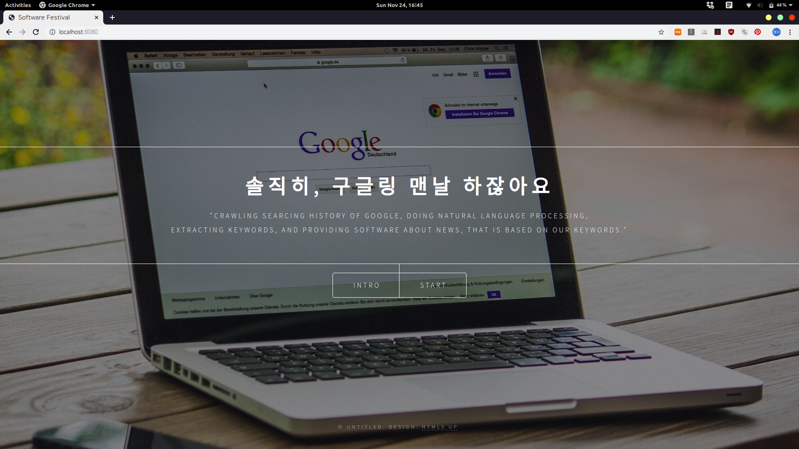
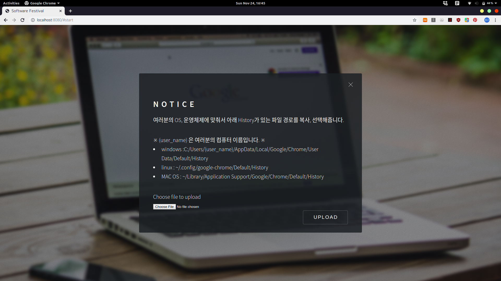
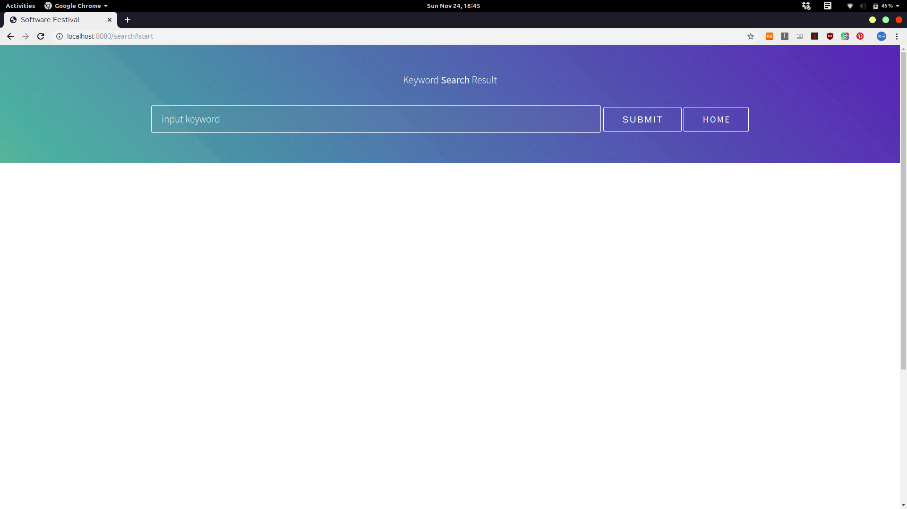

# Search Beyond Your World

## Theme

우리는 현재 지금 정보화 시대를 살아가고 있기 때문에 같은 keyword에 대하여 다른 사람들은 보았지만 나는 보지 못했던 정보를 아는 것은 굉장히 중요합니다. 이 웹페이지의 서비스로 서로의 정보와 지식을 공유하여 집단지성을 이끌어 낼 수 있다고 생각합니다.

Client들의 Google의 검색엔진 Chrome의 History를 분석하여, 토큰 별로 URL을 나눈 테이블을 가지고 있습니다. 만약 사용자 A가 Keyword를 입력하면, A의 History와 데이터베이스를 비교하여 입력한 Keyword에 대하여 아직 방문하지 못한 url을 보여주는 웹 페이지입니다.

## Structure



## Execute

```shell
    pip -r requirements.txt
    cd w500
    npm install
    npm start
```

## Settings

~~~
pip install konlpy
pip install sonlpy
pip install pandas
pip install tensorflow
pip install JPype1 == 0.6.3
~~~

위와 같은 code를 terminal, cmd 창에서 실행합니다. JPype1이 0.7.0을 0.6.3로 downgrade 해야 오류가 발생하지 않습니다.<br>

~~~
pip install -r requirements.txt
pip install JPype1 == 0.6.3
~~~

위의 과정이 어려운 경우, requirements.txt를 실행한 후, 똑같이 JPype1을 0.6.3으로 downgrade 시켜줍니다.<br>
<br>
npm과 nodejs는 항상 최신 버젼을 유지합니다.<br>
nodejs == 6.0.0
npm == 3.8.6

## How to use

```shell
    pip -r requirements.txt
    cd w500
    npm install
    npm start
```

1. 홈페이지에 Info 를 눌러 주의사항을 확인
2. 홈페이지에 start 부분을 클릭
3. 구글 로그인 창으로 연결되면, 보여진 아이디 창을 클릭한 후, 연결
4. OS에 따라 주어진 경로에서 chrome의 History 데이터베이스 파일을 send
5. 검색어 창에 내가 입력하고 싶은 keyword 입력
6. 출력된 결과 확인

## Screenshot



